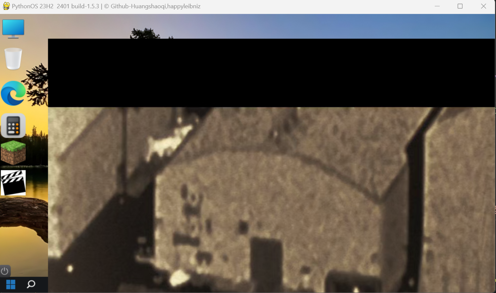

# Python-Operating-System

# PythonOS

<div align="center">
<p align="center">
    
  .png)
  
  <h3 align="center">PythonOS</h3>   
  <a href="https://githubfast.com/happyleibniz/Python-Operating-System/releases">下载其他版本</a>
    ·
  <a href="https://githubfast.com/Github-Huangshaoqi/PythonOS/issues">报告Bug</a>
  <a href="https://githubfast.com/happyleibniz/Python-Operating-System/issues">报告Bug2</a>
    ·
  <a href="https://githubfast.com/Github-Huangshaoqi/PythonOS/issues">提出新功能</a>
</p>
</div>

<div align="center">
<p align="center">
  <a href="https://x.com/@Pythonos2">PythonOS X</a>
    ·
  <a href="https://t.me/PythonOS">Telegram</a>
   ·
  <a href="https://discord.gg/sbKMNhuvYt">Discord 交流群</a>
</p>
</div>

:tada:PythonOS 是一个用 Python 编写的简单操作系统。该项目的目标是提供一个基本的操作系统框架，以便学习和实验操作系统的基本概念。:tada:

而且免费 :free:


## 概述

- :star:使用 Python 编写，易于理解和修改。
- :star:提供基本的操作系统组件，如进程管理、内存管理等。
- :star:提供视频播放服务:trollface::trollface::trollface:
- ~~⭐可拖动pythonOS窗口~~**BUG满天飞**
- ~~:star:支持在模拟环境中运行，方便调试和测试。~~ **还没实现** :trollface:

更多详情请见[docs/wiki.md](docs/wiki.md)

## 目录

- [概述](#概述)
- [效果](#效果)
- [快速开始](#快速开始)
  - [环境要求](#环境要求)
  - [安装依赖](#安装依赖)
  - [运行](#运行)
- [项目结构](#项目结构)
- [贡献](#贡献)
- [许可证](#许可证)

## 效果

.png)



## 快速开始

### 环境要求

- Python 3.x 
- 依赖库 [安装依赖](#安装依赖)

### 安装依赖

```bash
pip install pygame
pip install psutil
pip install easygui
pip install pil
pip install opencv-python
pip install ffpyplayer
```

### 运行

```bash
python main.py
```


## 项目结构
> - `font/`:字体文件夹 :capital_abcd:
> - `images/`:图片文件夹 :flower_playing_cards:
> - `software/`:系统应用文件夹 :computer:
>   - `code/`:用于存储exe应用的源代码文件夹 :computer:
> - `system/`:用于存放系统设置变量或其他配置文件的文件夹 :computer:
> - `Disk/`:虚拟磁盘文件夹 :floppy_disk:

## 贡献
你可以[fork](https://githubfast.com/Github-Huangshaoqi/PythonOS/fork)项目到你的仓库更改，然后pull过来 :blush: :tada:

## 许可证
该项目采用 [MIT](https://githubfast.com/Github-Huangshaoqi/PythonOS?tab=MIT-1-ov-file)协议 

- :copyright:  Github-Huangshaoqi 2024

- :copyright:  [happyleibniz](https://githubfast.com/happyleibniz) 2024

- ##alpha v1.0版本
- :copyright:  [happyleibniz](https://githubfast.com/happyleibniz) 2023
